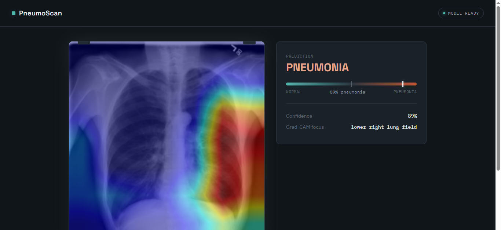
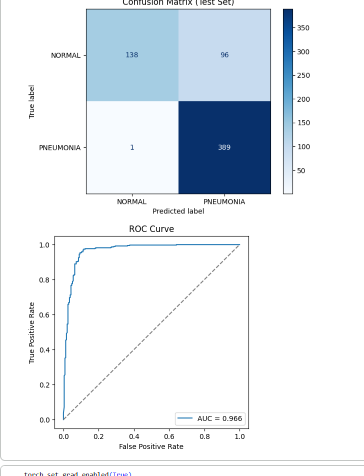

# PneumoScan — AI-Assisted Pneumonia Detection from Chest X-Rays

An end-to-end deep learning portfolio project for detecting pneumonia from chest X-ray images using a fine-tuned **ResNet18** model. The project covers data preparation, model training and evaluation, Grad-CAM explainability, and an interactive **Streamlit clinical-style workstation** for inference.

> ⚠️ **Educational / portfolio project only.** PneumoScan is not a medical device, is not clinically validated, and must not be used to diagnose, treat, or rule out disease. Any real clinical decision should be made by a qualified healthcare professional.

## Demo

The current user-facing application is a Streamlit app designed as a dark, radiology-inspired workstation. It supports:

- Chest X-ray upload (`JPG`, `JPEG`, `PNG`)
- Basic technical image-quality checks
- ResNet18 inference
- Pneumonia probability and model confidence
- `NORMAL` / `PNEUMONIA` prediction using a configurable decision threshold
- Original image and Grad-CAM explainability views
- A plain-language attention/focus summary
- Explicit AI-assistance and clinical-safety messaging
- Model loading from a local checkpoint or optional Hugging Face Hub fallback

The Streamlit interface is implemented in [`app/streamlit_app.py`](app/streamlit_app.py).

## Repository structure

```text
Pneumonia-Detector/
├── notebooks/
│   └── pneumonia_detection.ipynb   # Data pipeline, training, evaluation & Grad-CAM
├── app/
│   ├── streamlit_app.py            # Main Streamlit inference application
│   ├── app.py                      # Original Flask inference application/API
│   ├── requirements.txt            # Python dependencies
│   ├── models/                     # Local model checkpoint (not committed)
│   ├── screenshots/                # Project screenshots/evaluation figures
│   ├── .streamlit/                 # Streamlit configuration
│   ├── templates/                  # Flask frontend
│   └── static/                     # Flask frontend assets
├── LICENSE
└── README.md
```

## Screenshots

### Streamlit clinical workstation

Upload a chest X-ray, run the model, review the probability readout, and inspect the original image alongside the Grad-CAM explanation.



### Model evaluation

The training notebook includes evaluation outputs such as the confusion matrix and ROC curve on the held-out test set.



## Model and dataset

The model is trained using the **Chest X-Ray Images (Pneumonia)** dataset from Kermany et al., commonly distributed through Kaggle. The classifier uses a **ResNet18** backbone with transfer learning.

The training pipeline:

1. Re-splits the available data into train/validation/test sets because the original validation split is too small for reliable model selection.
2. Applies image augmentation to the training data.
3. Converts grayscale X-rays to three channels and normalizes using ImageNet statistics.
4. Uses a pretrained ResNet18 architecture with a binary classification head.
5. Fine-tunes later ResNet layers and the classification head.
6. Uses a `pos_weight`-adjusted loss to account for class imbalance.
7. Trains with Adam, `ReduceLROnPlateau`, and early stopping based on validation loss.

## Reported test-set results

The current notebook reports the following results at a decision threshold of **0.85**:

| Metric | Value |
|---|---:|
| ROC-AUC | 0.966 |
| Recall (PNEUMONIA) | 98.7% |
| Precision (PNEUMONIA) | 85.6% |
| F1-score | 0.917 |
| Accuracy | 88.8% |

These are held-out test-set results from the project dataset and should **not** be interpreted as clinical performance. In particular, the threshold was selected after inspecting test-set behavior, so the reported metrics should be treated as portfolio-project results rather than an unbiased prospective evaluation.

## Explainability with Grad-CAM

PneumoScan generates a **Grad-CAM** heatmap from the final convolutional feature layer of ResNet18. The heatmap is intended to help visualize image regions that influenced the model output.

The application deliberately describes Grad-CAM as an **explainability aid**, not as a clinically validated lesion-localization method. A highlighted region does not prove that pneumonia is present there, and the visualization should not be interpreted as a radiological finding.

## Streamlit application

### Run locally

From the repository root:

```bash
cd app
python -m venv venv

# Linux / macOS
source venv/bin/activate

# Windows
# venv\\Scripts\\activate

pip install -r requirements.txt
streamlit run streamlit_app.py
```

Streamlit will provide a local URL, normally similar to:

```text
http://localhost:8501
```

### Model checkpoint

The application expects the trained checkpoint at:

```text
app/models/pneumonia_resnet18.pt
```

The checkpoint is intentionally not committed to Git. If the local model file is missing, the Streamlit app can optionally download it from the Hugging Face Hub when the following environment variables are configured:

```text
HF_MODEL_REPO_ID=<your-hugging-face-repository>
HF_MODEL_FILENAME=pneumonia_resnet18.pt
```

The model path can also be overridden with:

```text
MODEL_PATH=<path-to-model-checkpoint>
```

### Decision threshold

The default pneumonia decision threshold is:

```text
0.85
```

It can be overridden with:

```text
PNEUMONIA_THRESHOLD=0.85
```

The threshold controls the final `NORMAL` / `PNEUMONIA` label; it does not change the underlying model probability.

## Streamlit inference workflow

The current application follows this flow:

```text
Upload X-ray
    ↓
Basic technical quality checks
    ↓
Image preprocessing
    ↓
ResNet18 inference
    ↓
Pneumonia probability
    ↓
Threshold-based prediction
    ↓
Grad-CAM generation
    ↓
Clinical-style AI readout + explanation
```

The model loader returns the model, Grad-CAM object, class mapping, and model status together. This keeps the class mapping available during inference and prevents the previous `idx_to_class` undefined-variable failure.

## Original Flask application

The repository also retains the earlier Flask implementation in [`app/app.py`](app/app.py). It provides a traditional web/API interface with:

- `GET /` for the upload page
- `POST /predict` for image inference
- ResNet18 prediction
- Grad-CAM heatmap generation
- JSON responses containing prediction, confidence, probability, focus information, and encoded images

The **Streamlit application is the current primary UI** for the project; the Flask implementation is retained as an alternative/earlier serving interface.

## Limitations

- The dataset comes from a limited clinical setting and is primarily pediatric; generalization to adults, different hospitals, scanners, populations, and acquisition protocols is unverified.
- No external validation on an independent dataset has been performed.
- Dataset-specific artifacts and acquisition differences may influence model predictions.
- Grad-CAM can highlight central or mediastinal regions rather than clinically meaningful lung pathology.
- The current 0.85 threshold was selected using test-set inspection, introducing a risk of optimistic metric reporting.
- Basic image-quality checks are technical heuristics, not a substitute for radiological quality assessment.
- The model may produce confident predictions on images outside its training distribution.
- The application does not replace a radiologist or physician.

## Possible future improvements

- Tune the decision threshold using only the validation set before final test evaluation.
- Perform external validation on an independent chest X-ray dataset.
- Compare additional backbones such as DenseNet121 or EfficientNet.
- Add lung-field segmentation/cropping to reduce reliance on non-pulmonary regions.
- Add calibration analysis and uncertainty estimation.
- Add batch inference and prediction-history functionality.
- Improve automated detection of out-of-distribution or non-chest-X-ray inputs.
- Deploy the Streamlit application for controlled public demonstration.

## References and acknowledgments

- **Dataset:** Kermany, D., Zhang, K., & Goldbaum, M. *Labeled Optical Coherence Tomography (OCT) and Chest X-Ray Images for Classification* (2018), distributed via Kaggle.
- **Grad-CAM:** Selvaraju et al., *Grad-CAM: Visual Explanations from Deep Networks via Gradient-based Localization* (2017).

## License

MIT — see [`LICENSE`](LICENSE).
